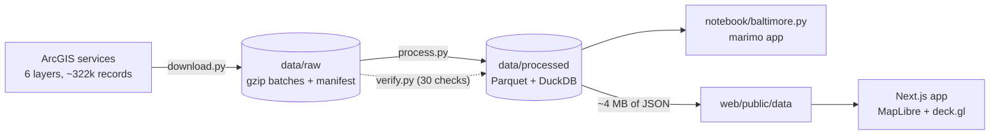

<div align="center">

# bmore.casa

**Explore the changing landscape of Baltimore, one building at a time.**

An interactive 3D data twin of Baltimore City's housing records — open vacant building notices, rehab permits,
city demolitions and building permits — built for HopHacks 2026 on real Baltimore City open data.

[](https://bmore.casa)
[](https://github.com/pwnwriter/baltimore-reborn/actions/workflows/ci.yml)
[](https://github.com/pwnwriter/baltimore-reborn/releases/latest)
[](https://hophacks.com)
[](https://data.baltimorecity.gov)


<br>


[**Live app**](https://bmore.casa) ·
[Quick start](#quick-start) ·
[Data sources](#data-sources) ·
[Pipeline](#how-the-pipeline-works) ·
[Findings](#verified-patterns) ·
[Notebook (hosted)](https://bmore.casa/notebook/) ·
[Notebook (molab)](https://molab.marimo.io/notebooks/nb_ThUzURg3SKsod1RDYv1Vm9) ·
[Notebook docs](notebook/README.md)

</div>

---

> *How is Baltimore's housing landscape changing, and what can the city's public records tell us about different neighborhoods?*

> [!NOTE]
> Housing statistics in the app, notebook and this README are computed from the downloaded records.
> The property film uses Google Photorealistic 3D Tiles for a camera tour of the real building and
> surroundings. A separate photo-based renovation film is explicitly labeled as an AI concept.

<details>
<summary><b>Table of contents</b></summary>

- [What's inside](#whats-inside)
- [Quick start](#quick-start)
  - [All commands](#all-commands)
  - [Environment variables](#environment-variables)
  - [Property films: existing and proposed](#property-films-existing-and-proposed)
  - [Optional photorealistic 3D city](#optional-photorealistic-3d-city)
  - [Works offline](#works-offline)
- [The app](#the-app)
- [Data sources](#data-sources)
- [How the pipeline works](#how-the-pipeline-works)
  - [Things the data taught us](#things-the-data-taught-us-and-how-they-are-handled)
  - [What each metric counts](#what-each-metric-counts)
- [Verified patterns](#verified-patterns)
- [Project structure](#project-structure)
- [CI and releases](#ci-and-releases)
- [Attribution](#attribution)

</details>

## What's inside

| | |
|---|---|
| 🗺️ **Web app** | Next.js 16 · TypeScript · Tailwind 4 · MapLibre GL 6 · deck.gl 9 |
| 🧪 **Data pipeline** | Python 3.12+ · uv · httpx · Polars · DuckDB · Shapely |
| 📓 **Notebook** | marimo · Plotly · DuckDB — a standalone reactive app |
| 🤖 **Optional AI** | Gemini (grounded Q&A and tour scripts) · Veo (renovation films) · ElevenLabs (narration) |
| 🎬 **Property film** | Three.js · NASA-AMMOS 3D Tiles Renderer · Google photogrammetry |
| 🏙️ **Optional photoreal 3D** | Google Photorealistic 3D Tiles via deck.gl `Tile3DLayer` (Cesium ion token or Maps key) |

## Quick start

The repo has two halves: [`web/`](web) (the Next.js app) and [`notebook/`](notebook) (the marimo notebook, the Python
pipeline and its Parquet data). Processed data ships in the repo (`web/public/data`,
`notebook/data/processed/*.parquet`), so both run straight after a clone.

```bash
# 1. web app
cd web
bun install                 # also copies the MapLibre worker and Draco decoders (postinstall)
bun run dev                 # http://localhost:3000

# 2. marimo notebook
cd ../notebook
uv sync
uv run marimo run baltimore.py     # interactive app  -> http://localhost:2718
uv run marimo edit baltimore.py    # development / editing mode
```

> [!TIP]
> `npm install` / `npm run dev` work too. With Nix + direnv, `direnv allow` provides bun, node and uv.
> Just want the notebook? Grab `bmore-casa-submission.zip` from the
> [latest release](https://github.com/pwnwriter/baltimore-reborn/releases/latest), extract it and run
> `uvx marimo run --sandbox baltimore.py` — no clone needed.

### All commands

`uv` commands run from `notebook/`, `bun` commands from `web/`.

| Command | What it does |
|---|---|
| `uv run bmore-casa refresh` | Download every layer from ArcGIS, then rebuild Parquet, DuckDB and frontend assets |
| `uv run bmore-casa download [--only permits …]` | Download only (raw batches → `data/raw/`) |
| `uv run bmore-casa process` | Re-process existing raw data (no network) |
| `uv run bmore-casa verify` | 30 independent checks: counts, dates, coordinates, aggregates |
| `uv run marimo run baltimore.py` | Notebook as an interactive application |
| `uv run python baltimore.py` | Execute every notebook cell headlessly (CI check) |
| `uv run python scripts/package_notebook.py` | Build the portable submission ZIP into `dist/` |
| `bun run dev` / `bun run build && bun run start` | Development / production web app |
| `bun run typecheck` | `tsc --noEmit` |
| `bun test` | Reference, geometry, tile-proxy, camera-path and video API tests |

A full refresh downloads ~322k records and takes about two minutes.

### Environment variables

Everything below is **optional**. Create `web/.env` (git-ignored) — keys stay on the server and are never sent to the browser.
Without keys the matching controls report that they are unconfigured; everything else works.

| Variable | Enables |
|---|---|
| `GEMINI_API_KEY` | "Ask Baltimore", tour scripts and Veo renovation films |
| `ELEVENLABS_API_KEY` | Answer and property narration |
| `CESIUM_ION_TOKEN` | Photorealistic 3D city and property films — free for non-commercial use: [cesium.com/ion](https://cesium.com/ion) → Asset Depot → add "Google Photorealistic 3D Tiles" → Access Tokens. `CESIUM_API_KEY` and `CECIUM_API_KEY` are accepted as aliases |
| `GOOGLE_MAPS_API_KEY` | Alternative to the Cesium token: a Maps Platform key with the "Map Tiles API" enabled (billing, metered) |
| `GEMINI_MODEL`, `GEMINI_PROPERTY_MODEL`, `GEMINI_VIDEO_MODEL` | Model overrides |
| `ELEVENLABS_VOICE_ID`, `ELEVENLABS_MODEL_ID` | Voice and speech-model overrides |
| `SITE_URL` | Public origin used for share-card and canonical URLs (default `https://bmore.casa`) |

```bash
# web/.env
GEMINI_API_KEY=...
ELEVENLABS_API_KEY=...
CESIUM_ION_TOKEN=...       # or GOOGLE_MAPS_API_KEY=...
```

> [!WARNING]
> Before a public deployment, add authentication, usage limits and an upload-size limit at the reverse
> proxy: the AI endpoints consume the server account's quota and are intended for a local/demo app.

### Property films: existing and proposed

Select a property record, then **Explore building in 3D**.

<details>
<summary><b>Existing</b> — a narrated camera tour of the real building</summary>

<br>

**Existing** opens a full-screen textured 3D view using the same imagery source as God's Eye View.
A 36-second camera path approaches the record coordinate, orbits it, then pulls back to the neighborhood.
Play/pause, scrub, reset, and manual orbit controls are available. A Cesium ion token or Google Maps key is
required (see [below](#optional-photorealistic-3d-city)).

**Generate narration** asks Gemini for a script grounded only in the server-resolved public record,
then uses ElevenLabs for speech. The transcript is in Property details. **Record tour** captures the
camera sequence and optional narration; **Download film** saves WebM or MP4 depending on browser
support. Google attribution remains visible in the viewer and recording. Keep the tab visible while
recording; manual navigation, changing views, or hiding the tab pauses capture.

</details>

<details>
<summary><b>Proposed</b> — an AI renovation concept from your own photo</summary>

<br>

**Proposed** accepts a property photo you own or have permission to use (JPEG/PNG, up to 8 MB) and an
exterior renovation brief. Veo generates an 8-second, 720p concept video with realistic camera motion.
It is not an editable 3D model or evidence of an actual renovation. Google tile imagery is not used
as an AI reference. Generation requires Veo access and available billing/quota on the Gemini key.
Pending and completed operation tokens persist in this browser tab for up to 11 hours, so reopening
the same property can resume polling. A newly selected photo replaces that saved session.

</details>

<details>
<summary><b>API routes and defaults</b></summary>

<br>

| Route | Purpose |
|---|---|
| `GET /api/property/record` | Resolves a validated local record reference |
| `POST /api/property/story` | Generates the narration script |
| `POST /api/property/video` | Starts a photo-based Veo job |
| `GET /api/property/video` | Polls or streams the result using an expiring, signed token |

API keys stay server-side. Defaults are `gemini-3.6-flash` (with a fallback) and
`veo-3.1-fast-generate-preview`; override with `GEMINI_PROPERTY_MODEL` and `GEMINI_VIDEO_MODEL`.
Provider errors are shown without inventing output. The older schematic OSM endpoint remains available at
`/api/property` but is not used by the property film.

Run `bun test lib/property` (from `web/`) for reference, geometry, tile-proxy, camera-path and video API tests.

</details>

> [!IMPORTANT]
> Imagery has variable capture dates and resolution. The coordinate is not a verified parcel/building
> match. Neither aerial imagery nor records establish current condition, interiors, structural
> capacity, or renovation feasibility.

### Optional photorealistic 3D city

The *Photorealistic 3D city* toggle draws the records on top of **Google Photorealistic 3D Tiles** — Google's textured
photogrammetry of the real buildings (the same source used by projects such as *gods-eye-view*). It is real measured
geometry, labelled in-app as context imagery rather than DHCD data. Add `CESIUM_ION_TOKEN` **or** `GOOGLE_MAPS_API_KEY`
to `web/.env` ([see above](#environment-variables)) and restart.

Tiles are fetched through `/api/tiles3d/*`, a streaming server-side proxy, so the key never reaches the browser and
nothing is stored. With no key the toggle is disabled and the rest of the app is unaffected.

> [!NOTE]
> A Gemini / AI Studio key does **not** work here — Google rejects it for the Map Tiles API.

**3D map only.** Under the photoreal toggle, *3D map only* shows just the city: every record layer, label and panel is
hidden and the camera re-centres on the full viewport. *Show records & panels* (or <kbd>Esc</kbd>) brings everything back
exactly as it was — handy for opening a demo on the real city before revealing the data.

### Works offline

Once the data is downloaded the app makes **no ArcGIS calls at runtime** — it reads static files from `web/public/data`.
The street basemap (OpenFreeMap) is a progressive enhancement: if it cannot be reached within 3.5 s, the map falls back
to a fully local style where the official neighborhood polygons are the geography. The notebook's map is offline by default.

> [!TIP]
> Force the offline look any time with `http://localhost:3000/?basemap=off` — a useful safety net on venue Wi-Fi.

## The app

| | |
|---|---|
| **Opening** | A slow orbit over the live map with the title card; *Explore Baltimore* flies in. |
| **3D density** | 320 m hexagons whose height is the *number of records*, stacked by layer color. The height scale is pinned to the all-years maximum so dragging the timeline never rescales columns. They are statistics, not buildings: no footprints or heights are drawn because none were verified. |
| **Records** | Every notice, rehab and demolition as a clickable point; permits load per neighborhood. The card shows source layer, address, dates, status, parcel ID and any BLOCKLOT-linked records. |
| **Time machine** | A dual-handle year range with play; per-layer histograms show each source's coverage, and *What is counted?* spells out the semantics. |
| **Neighborhood insight** | Counts, rates per 1,000 parcels, rank, age of open notices, five-year windows, permit categories. |
| **Compare** | Two neighborhoods side by side (pick B from the list or click the map), shared-axis yearly charts, limits stated inline. |
| **Search** | Addresses across notices/rehabs/demolitions (plus the selected neighborhood's permits) and neighborhood names. |
| **Ask Baltimore** *(optional)* | The server computes a fact sheet for the current scope and year range; Gemini may only use those numbers, must name metric/place/period, and must refuse causal or "is this building vacant today" questions. Falls through to older models if one is overloaded. |

The city map uses MapLibre + deck.gl. The property film loads Three.js and 3D Tiles Renderer on demand
and disposes its renderer when closed; it does not use React Three Fiber.

## Data sources

All data is public and published by Baltimore City. Downloaded **2026-09-19**.

| Layer (as titled by the city) | Service | Records |
|---|---|---:|
| Vacant Building Notice - Open | [DHCD_Open_Baltimore_Datasets/FeatureServer/1](https://baltegis.baltimorecity.gov/mapping/rest/services/Housing/DHCD_Open_Baltimore_Datasets/FeatureServer/1) | 11,550 |
| Rehabs of Vacant Buildings | [.../FeatureServer/2](https://baltegis.baltimorecity.gov/mapping/rest/services/Housing/DHCD_Open_Baltimore_Datasets/FeatureServer/2) | 12,863 |
| Completed City Demo | [.../FeatureServer/0](https://baltegis.baltimorecity.gov/mapping/rest/services/Housing/DHCD_Open_Baltimore_Datasets/FeatureServer/0) | 4,276 (4,274 after 2 exact duplicates) |
| Building Permits | [.../FeatureServer/3](https://baltegis.baltimorecity.gov/mapping/rest/services/Housing/DHCD_Open_Baltimore_Datasets/FeatureServer/3) | 292,806 |
| All Vacant Building Notices | [Housing/dmxLandPlanning/MapServer/37](https://geodata.baltimorecity.gov/egis/rest/services/Housing/dmxLandPlanning/MapServer/37) | 11,481 (cross-check only, see below) |
| Neighborhood_NSA | [CityView/Neighborhoods/FeatureServer/0](https://geodata.baltimorecity.gov/egis/rest/services/CityView/Neighborhoods/FeatureServer/0) | 279 polygons + Census housing units |
| Property Information | [CityView/Realproperty_OB/FeatureServer/0](https://geodata.baltimorecity.gov/egis/rest/services/CityView/Realproperty_OB/FeatureServer/0) | 238,160 parcels (counted per neighborhood) |

## How the pipeline works

[`notebook/src/bmore_casa/`](notebook/src/bmore_casa) — `download.py` → `process.py` → `verify.py`.



1. **Metadata first.** Each layer's metadata is fetched and saved (`notebook/data/raw/<layer>/metadata.json`): fields, OID field, `maxRecordCount`, spatial reference.
2. **Count, then IDs.** `returnCountOnly` gives the API count; `returnIdsOnly` (not subject to `maxRecordCount`) gives every OBJECTID.
3. **Object-ID batching.** Features are pulled in OID ranges of ≤1,000, requested as WGS84 (`outSR=4326`; the services are natively Maryland State Plane, WKID 2248).
4. **Failure detection.** ArcGIS returns errors as HTTP 200 + `{"error":…}` — treated as failures and retried with backoff. A batch that reports `exceededTransferLimit` or returns a different number of features than expected is split in half and re-fetched. The run aborts unless downloaded == API count.
5. **Raw preserved.** Every batch is kept gzip-compressed in `notebook/data/raw/`, with a `manifest.json` of counts and timestamps.
6. **Normalize.** Dates → Baltimore calendar dates; addresses upper-cased and whitespace-collapsed; `BLOCKLOT` cleaned; exact duplicate rows dropped; coordinates validated against the city bounding box; neighborhood labels validated against the 279 official names, with point-in-polygon filling blanks.
7. **Store.** Parquet tables + `baltimore.duckdb` (tables and a `neighborhood_summary` view) in `notebook/data/processed/`, plus `quality_report.json` and `findings.json`.
8. **Ship light.** The browser gets ~4 MB: three point files (29k records), a hex-binned count grid for the 3D columns, neighborhood polygons, and year × type aggregates. The 293k permits are **never sent in bulk** — citywide they appear as aggregated columns, and individual permits load per neighborhood on demand.

### Things the data taught us (and how they are handled)

- **"All Vacant Building Notices" is not a history.** `DateCancel` and `DateAbate` are null on *every* record in both vacancy layers — they only contain notices still open. So the timeline shows *when today's open notices were issued*, never "vacant buildings in year X". The second layer is used only to cross-check the first.
- **Two timestamp conventions.** The DHCD service stores true UTC instants; the land-planning layer stores local wall-clock time labelled UTC (it trails by exactly 4 h in EDT / 5 h in EST). Both are normalized to local calendar dates.
- **OBJECTID is not unique** in the demolition layer: 9 IDs are reused for *different* demolition events. They are kept as separate records, and the downloader/processor never use OBJECTID as a join key.
- **Rehab records are a subset of permits.** All are `USE`/`BUSE` (use & occupancy) permits; every rehab record since 2019 also appears in the permit layer. The two are never added together.
- **Permits ≠ buildings.** 292,806 permits touch 90,556 parcels; 42,938 are modifications of earlier permits. Permit categories are inferred from case-number prefixes (checked against descriptions) because no code list is published. The permit system changed in early 2025 (`COM/USE/DEM…` → `BRCM/BCCM/BUSE…`) and counts dip that year.
- **Costs are unusable in aggregate** (−$6,000 to $4.4 billion): shown per record only, never summed.
- **`BLOCKLOT` is a reliable shared key**, so cross-layer links use it exclusively — never fuzzy address matching.
- **Denominator.** Rates are per 1,000 real-property parcels in each neighborhood (408 of 238,160 parcels lack a matching neighborhood label and are excluded).

### What each metric counts

| Metric | One record is… | Placed on the timeline by |
|---|---|---|
| Open vacant building notices | a notice still open at download (one per parcel) | date the notice was issued |
| Rehab permits on vacant buildings | a use & occupancy permit on a building that had a notice (one per parcel) — not proof of completed work | permit issue date |
| Completed city demolitions | a city-led demolition marked complete — a one-time event; private demolitions are absent | recorded finish date |
| Building permits | an issued permit or permit modification — not a building, not completed construction | issue date |

## Verified patterns

Generated by `process.py` into `notebook/data/processed/findings.json`; re-computed live in the notebook.

1. **Many open notices are old.** Of 11,550 open notices, 3,383 (29%) were issued before 2016 — the oldest on 2004-11-05 — while 5,775 (50%) date from 2022 or later.
2. **Vacancy is concentrated.** 10 of 279 neighborhoods hold 38% of open notices; 65 have none. Carrollton Ridge has 745 — 329 per 1,000 parcels, the highest rate among neighborhoods with ≥100 parcels.
3. **The recorded response changed shape.** Completed city demolitions peak at 780 in 2019 and fall to 163 in 2025, while rehab permits on vacant buildings rise from 959 (2015) to 1,253 (2024).
4. **A permit is not an ending.** 202 open-notice parcels also have a rehab permit record — in all 202 cases issued *before* the currently open notice. The records cannot say whether those rehabs were completed.
5. **Neighbors can look very different.** Broadway East vs adjacent McElderry Park, all years: 187 vs 67 open notices, 138 vs 10 demolitions, and 118 vs 212 rehab records per 1,000 parcels.

> [!IMPORTANT]
> These are descriptive. The records do not establish *why* places differ or change.

## Project structure

```
web/                       Next.js app (bun project)
  app/                     App Router (page, layout, /api/ask, /api/speak, /api/tiles3d),
                           favicon (icon.svg, apple-icon) and the generated share card (opengraph-image)
  components/map/          CityMap - MapLibre + deck.gl overlay
  components/dashboard/    Explorer, panels, timeline, search, record card, Ask Baltimore
  components/charts/       YearBars (SVG)
  components/property/     Photorealistic tour, narration, recording and renovation video
  lib/data/                asset loading, statistics, fact sheet, types
  lib/property/            Record lookup, tile rewriting, camera path, recording and video tokens
  lib/geo/                 colors, layer definitions, map style + offline fallback
  scripts/                 copy-maplibre-worker.mjs (postinstall)
  public/data/             frontend assets (written by the pipeline)
notebook/                  marimo notebook + data pipeline (uv project)
  baltimore.py             marimo notebook / app
  baltimore-data.zip       data snapshot for standalone / molab copies
  src/bmore_casa/          Python pipeline: sources, download, process, verify, cli
  scripts/                 package_notebook.py (builds the submission ZIP)
  data/raw/                raw ArcGIS batches (git-ignored, reproducible)
  data/processed/          Parquet, quality_report.json, findings.json (+ DuckDB, git-ignored)
deploy/                    Caddy config + run commands: web app at /, notebook at /notebook
.github/workflows/         ci.yml (every push / PR), release.yml (tags)
```

## CI and releases

Every push and pull request runs two jobs ([`ci.yml`](.github/workflows/ci.yml)), neither of which needs secrets:

| Job | Steps |
|---|---|
| **Web** | `bun install --frozen-lockfile` → typecheck → `bun test` → `next build` |
| **Notebook** | `uv sync --locked` → `marimo check` → headless run of every cell → build the submission ZIP → run that ZIP standalone outside the repo (what someone without the repo gets) → check the tracked `baltimore-data.zip` still matches the data it was built from. The ZIP is kept as a workflow artifact. |

Pushing a tag publishes a [GitHub release](https://github.com/pwnwriter/baltimore-reborn/releases) with
`bmore-casa-submission.zip`, `baltimore-data.zip` and checksums, after re-running the notebook checks
([`release.yml`](.github/workflows/release.yml)):

```bash
git tag v0.1.0 && git push origin v0.1.0
```

## Attribution

- **Housing records** — Baltimore City Department of Housing & Community Development (DHCD) via Open Baltimore.
- **Boundaries and parcels** — Baltimore City Enterprise GIS.
- **Basemap** — [OpenFreeMap](https://openfreemap.org) © [OpenMapTiles](https://www.openmaptiles.org/), data © [OpenStreetMap](https://www.openstreetmap.org/copyright) contributors.
- **Photorealistic 3D** — Google Photorealistic 3D Tiles; attribution stays visible in the viewer and in recordings.

<div align="center">
<sub>Built at HopHacks 2026 · <a href="https://bmore.casa">bmore.casa</a></sub>
</div>
